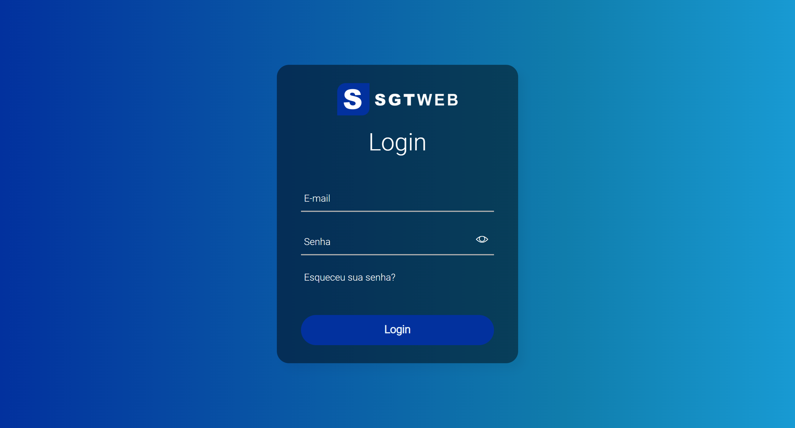

## Jordão Dantas

Me chamo Jordão Lima Dantas, 25 anos, e sou um desenvolvedor web recém formado em ciência da computação pela UEPB. Conhecimento intermediário em PHP/Laravel, HTML5/CSS3, Bootstrap e Banco de Dados MySql. Também possuo conhecimentos básicos nas linguagens Java, JavaScript e Python.  No link no final do texto pode-se visualizar um Pequeno ERP voltado a atender as necessidades de microindústrias têxteis da cidade de São Bento - PB. Projeto realizado durante o percurso do meu trabalho de conclusão de curso (TCC). Durante o desenvolvimento do sistema, foram utilizadas as linguagens e tecnologias PHP, JavaScript, MySql, HTML5, CSS3 e Bootstrap.

https://youtu.be/bIabpEGUiQo

## Projeto SGTWEB

 Tela de Login

 Home

 Tela Funcionários 

## Layout site Câmara de Vereadores

 Home

